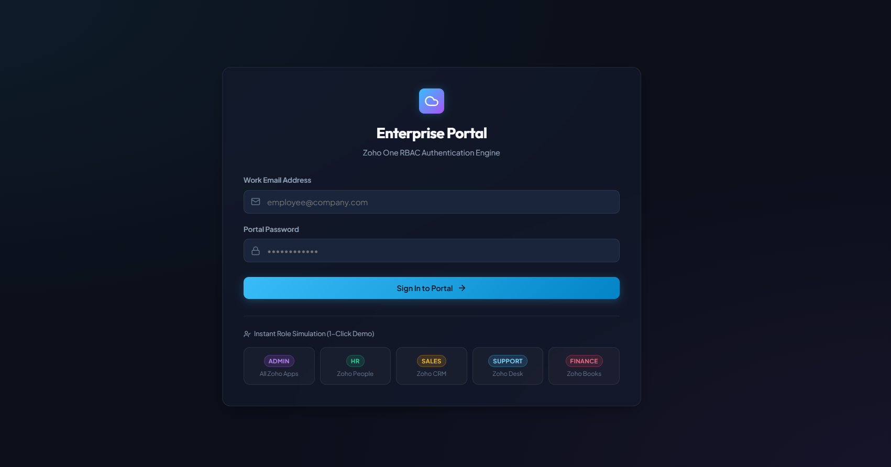
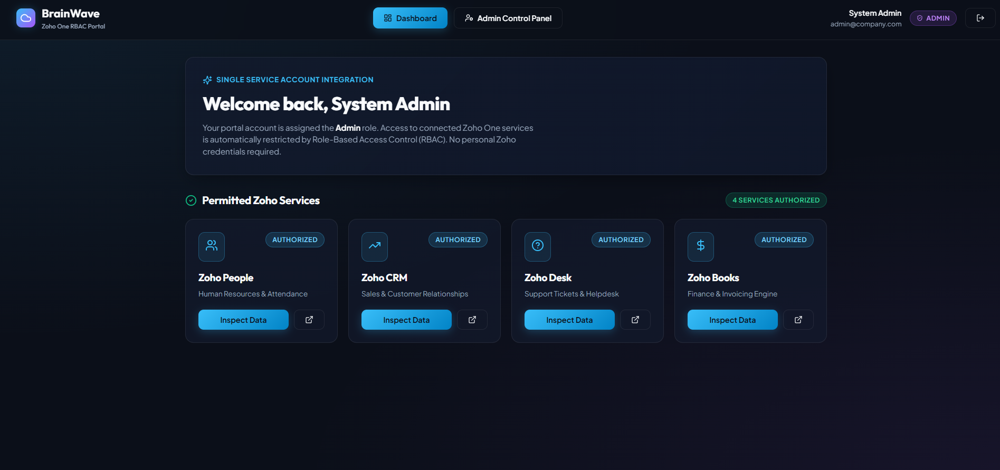
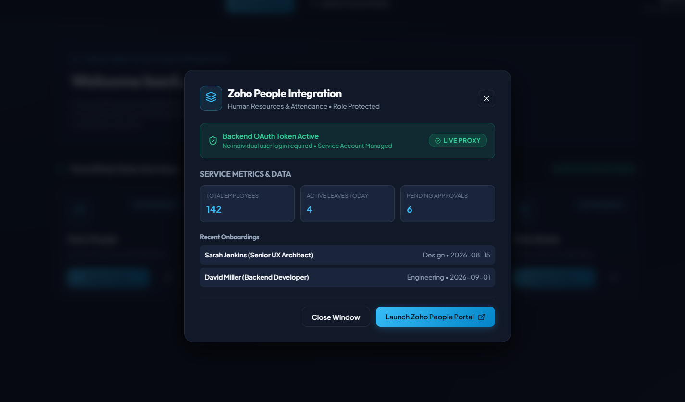
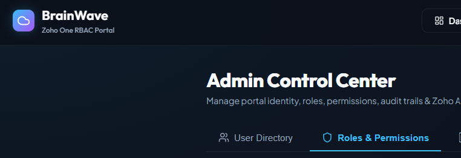
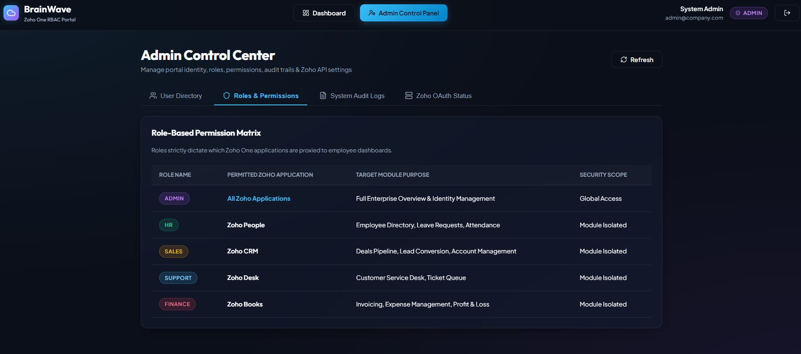
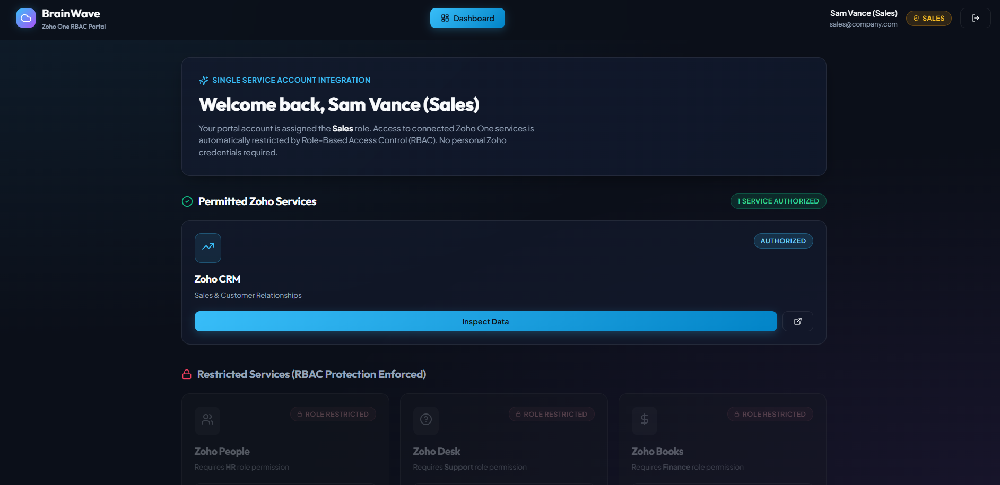

# Custom Employee Portal

A full-stack **Custom Employee Portal** designed to manage employee information through a user-friendly web interface. The application provides functionality for managing employee records, viewing details, and performing common employee management operations.

## 🚀 Features

* Employee registration and management
* View employee details
* Add new employees
* Update employee information
* Delete employee records
* Search and manage employee data
* Responsive user interface
* REST API integration
* Database connectivity
* Clean and simple dashboard interface

## 🛠️ Technologies Used

### Frontend

* HTML5
* CSS3
* JavaScript
* React.js
* Bootstrap / Tailwind CSS

### Backend

* Node.js
* Express.js

### Database

* MongoDB

### Tools

* Git & GitHub
* Visual Studio Code
* Postman
* npm

## 📂 Project Structure

```text
Custom-Employee-Portal/
│
├── frontend/
│   ├── public/
│   ├── src/
│   │   ├── components/
│   │   ├── pages/
│   │   ├── App.jsx
│   │   └── main.jsx
│   ├── package.json
│   └── ...
│
├── backend/
│   ├── controllers/
│   ├── models/
│   ├── routes/
│   ├── middleware/
│   ├── server.js
│   └── package.json
│
├── OP/
│   ├── Op1.png
│   ├── Op2.png
│   ├── Op3.png
│   ├── Op4.png
│   └── Op5.png
│
├── .gitignore
└── README.md
```

> **Note:** Update the folder/file names above if your actual project structure is different.

## ⚙️ Installation & Setup

### 1. Clone the Repository

```bash
git clone https://github.com/surajingle07/Custom-Employee-Portal.git
```

### 2. Navigate to the Project

```bash
cd Custom-Employee-Portal
```

### 3. Install Frontend Dependencies

```bash
cd frontend
npm install
```

### 4. Install Backend Dependencies

Open another terminal:

```bash
cd backend
npm install
```

### 5. Configure Environment Variables

Create a `.env` file inside the backend directory.

Example:

```env
PORT=5000
MONGO_URI=your_mongodb_connection_string
```

Do not upload your `.env` file to GitHub.

### 6. Start the Backend

```bash
npm start
```

or, if using nodemon:

```bash
npm run dev
```

### 7. Start the Frontend

Inside the frontend directory:

```bash
npm run dev
```

The application will then be available at the local URL shown in your terminal.

## 🖥️ Output / Screenshots

The following screenshots demonstrate the application's user interface and functionality.










> Place your screenshots inside the `OP` folder and name them `Op1.png`, `Op2.png`, etc. If your screenshots have different names, update the paths accordingly.

## 🔄 Application Workflow

```text
User
  │
  ▼
Employee Portal
  │
  ├── View Employees
  │
  ├── Add Employee
  │
  ├── Update Employee
  │
  └── Delete Employee
          │
          ▼
      REST API
          │
          ▼
       MongoDB
```

## 🔌 API Operations

The backend provides REST APIs for employee management.

| Method | Operation       | Description                 |
| ------ | --------------- | --------------------------- |
| GET    | Get Employees   | Fetch employee records      |
| GET    | Get Employee    | Fetch a specific employee   |
| POST   | Add Employee    | Create a new employee       |
| PUT    | Update Employee | Update employee information |
| DELETE | Delete Employee | Remove an employee          |

> Update the API endpoint names in this table according to your actual backend routes.

## 📱 Responsive Design

The application is designed to provide a smooth experience across different screen sizes, including:

* Desktop
* Laptop
* Tablet
* Mobile devices

## 🔐 Security

* Environment variables are used for sensitive configuration.
* Database credentials are not stored directly in source code.
* `.env` is excluded using `.gitignore`.

## 🎯 Future Enhancements

* Employee authentication and authorization
* Admin and employee roles
* Employee attendance management
* Leave management
* Profile management
* Salary/payroll management
* Advanced employee search and filtering
* Dashboard analytics
* Cloud deployment

## 👨‍💻 Author

**Suraj Ingle**

Electronics & Telecommunication Engineering
Full-Stack / MERN Developer

### GitHub

https://github.com/surajingle07

## ⭐ Support

If you find this project useful, consider giving the repository a ⭐ on GitHub.

---

## 📄 License

This project is developed for learning and portfolio purposes.
